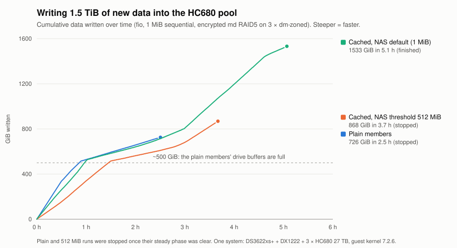

# 09 — Cache devices without a rebuild, three fixes, and what all-cached members change

October 2026 on the reference system (DS3622xs+, DX1222, 3 × HC680, guest kernel Ubuntu mainline
7.2.6). Everything here was done first in a lab VM with emulated host-managed drives (file-backed ZBC
through tcmu-runner), then on the real pool.

## Contents

1. [Summary](#1-summary)
2. [Attaching and detaching a cache device without a rebuild](#2-attaching-and-detaching-a-cache-device-without-a-rebuild)
3. [Measured: plain members vs cached members](#3-measured-plain-members-vs-cached-members)
4. [Bugs found, and the patches](#4-bugs-found-and-the-patches)
5. [Traps](#5-traps)
6. [Also tested](#6-also-tested)
7. [What is still untested](#7-what-is-still-untested)

## 1. Summary

- A dm-zoned **cache device can now be attached to or detached from a live RAID member in a few
  minutes**, without reformatting and without a rebuild (`tools/dmz-encache.py`,
  `tools/dmz-uncache.py`, wrapped by `scripts/guest/zonedpool-encache-member` and
  `zonedpool-uncache-member`). `dmzadm` has no such operation. Eight conversions on the real 27 TB
  members so far, each followed by `mdadm --re-add` and a **5-second** bitmap resync.
- **With a cache device on every member, 1.5 TiB of fresh writes took 5.1 h instead of ~7 h**, the
  sustained rate after the buffers fill roughly doubled, and the drives write each byte about once
  instead of almost three times. The plain pool is still faster for the first ~500 GiB.
- With cache devices on the NAS, **leave DSM's SSD-cache threshold at its default (1024 KB)**. Caching
  the cache disks' streams on the NAS NVMe made bursts *slower* (the insert path tops out near
  170 MB/s) and floods the SSDs during every DSM Data Scrubbing.
- Three bugs, all fixed with small patches (`patches/`): dm-zoned idle reclaim copying random zone →
  random zone forever on a cache-device target, dm-zoned's reclaim worker not re-arming its idle poll
  (the reason for the reclaim kick in [05](05-operations-monitoring-performance.md)), `dmzadm --check`
  segfaulting on two-device sets, and libahci leaving FIS-based switching off after a hot-plug on a port
  multiplier. As of October 2026 none of them had a public report or fix.
- **Never run `dmzadm --repair` on a member whose check reports invalid chunk mappings**: in the lab it
  turned one damaged map block into the loss of every chunk on the member (section 5.1).

## 2. Attaching and detaching a cache device without a rebuild

### 2.1 How it works

A dm-zoned target with a cache device keeps **all** its metadata (superblocks, chunk map, block
bitmaps) on the cache device, numbers the cache device's zones first, and leaves only a "tertiary"
superblock in the drive's first zone. A single-device target keeps two metadata sets in the drive's
first conventional zones. The **data zones on the drive are the same in both layouts** — only the
metadata moves and every zone id shifts by the number of cache zones.

- `dmz-encache.py --cache <dev> --zoned <drive>` reads the single-device metadata, computes the
  two-device geometry exactly as `dmzadm --format` would (`dmz_locate_metadata`), writes both metadata
  sets to the cache device with all zone ids shifted, writes the tertiary superblock over the old
  primary superblock and **zeroes the old secondary superblock** (so a single-device table can never
  "recover" the stale set — see section 5.5).
- `dmz-uncache.py --cache <dev> --zoned <drive>` does the reverse. It also drops chunks whose zone holds
  no valid block (dm-zoned leaves fully discarded zones mapped), moves data out of the conventional zones
  the new metadata needs (seq → conv relocation when the reserve of free sequential zones is short),
  resets now-unmapped sequential zones and writes set 1, then set 0, superblock last.
- Both are **offline** (the dm-zoned target removed), use `O_DIRECT` for all device I/O (a buffered
  read once returned an older copy of a zone), refuse undrained buffer zones, write backups first and
  verify what they wrote by reading it back. `--dry-run` works on a live target and prints the plan.
- Layout details and kernel/tool source citations: [tools/dmz-cache-layout-SPEC.md](../tools/dmz-cache-layout-SPEC.md).

### 2.2 Procedure for one member (pool stays online, degraded for minutes)

`scripts/guest/zonedpool-encache-member <dzN> <cache>` and `zonedpool-uncache-member <dzN>` do this with a
gate at every step (log in `/var/log/zonedpool-{en,un}cache.log`):

1. md must be complete, idle and have an **internal write-intent bitmap** (`mdadm --grow --bitmap=internal`).
2. For a detach: set the member's recorded size to the plain size first:
   `echo $(cat /sys/block/md127/md/component_size) > /sys/block/md127/md/dev-<dm-N>/size`. The cached target
   is larger; md remembers that and refuses a smaller member later (section 5.4).
3. `mdadm --fail` + `--remove` the member.
4. Drain it outside md (`dmsetup message <dzN> 0 reclaim`, wait) until the tool's `--dry-run` passes; md's
   own superblock writes land in the buffer again while the member is in the array.
5. `dmsetup remove <dzN>`, run the tool, check the result: `dmzadm --check` (single device) or the patched
   `dmzadm --check <cache> <drive>` (two devices; stock 2.2.2 segfaults there, section 4.3).
6. Update `/etc/zonedpool/dmzoned.conf` (third field = cache device), create the target, `mdadm --re-add`.

Real runs: the first detach (2026-10-03, after a full trim) dropped 92,598 emptied chunks and reset as many
zones in 371 s, the whole procedure took 8 minutes, and an md check over the whole array afterwards found
**0 mismatches**. Attaching caches to all three members on 2026-10-07 took **9 minutes in total**; two
detaches and two attaches on 2026-10-08 took 3 minutes each. Every re-add resynced in 5 seconds.

The cache device must be an exact multiple of the zone size (256 MiB) and hold at least two metadata sets
plus one zone (here 4 + 4 + 1 zones). The reference system uses one 256–260 GiB VMM virtual disk per member.

## 3. Measured: plain members vs cached members

Same test each time: `fio`, 1 MiB sequential writes into eight fresh files, 1.5 TiB in total, on the
encrypted pool, NAS otherwise quiet (no Data Scrubbing, no RAID rebuild). The 512 GiB dm-cache volume cache
was active in all runs and let these long sequential streams pass through, as designed.

| 1.5 TiB of new data | Plain members | Cached, NAS threshold 524288 KB | **Cached, NAS threshold 1024 KB (default)** |
|---|---|---|---|
| First ~500 GiB | **~201 MB/s** | ~66 MB/s | ~155 MB/s |
| After that | ~45 MB/s | ~90 MB/s | 41 MB/s for ~200 GiB, then 75–117 MB/s |
| Whole 1.5 TiB | ~7 h (extrapolated) | ~5¾ h (extrapolated) | **5.1 h** (measured) |
| HC680 bytes written per user byte, sustained | 2.76 | ~1.4 | ~1.5 |
| What limits it | the drives: three members behind one port multiplier write ~300 MB/s together (section 5.3) | the NAS NVMe cache's insert path (~7,000 writes/s ≈ 170 MB/s), dips while the NAS flushes | the NAS HDDs while the cache disks fill and are read back at the same time |
| NAS NVMe cache load | none | ~170 MB/s for hours | ~120 MB/s for 30 min, then 14–80 MB/s |

<picture>
  <source media="(prefers-color-scheme: dark)" srcset="img/ingest-1.5tib-dark.svg">
  
</picture>

Chart: `tools/plot-ingest.py` from fio's write-bandwidth logs (10-second averages). The plain and 512 MiB runs were
stopped once their steady phase was clear.

Reading it:

- **Up to ~800 GiB the plain pool and the cached pool with the NAS default are almost identical**; the cached pool
  pulls ahead only after that. Below a few hundred GiB per write session there is no measurable difference.

- **Plain members** take new data into each drive's conventional-zone buffer (998 zones × 256 MiB ≈ 250 GiB
  per member) at the speed of the drives, then every byte has to be copied again from the buffer into a
  sequential zone while new data waits: ~45 MB/s, every byte written twice.
- **Cached members** take new data into the cache device (on the NAS), and reclaim writes each byte once,
  sequentially, to the drive. The HC680s were only ~19 % busy in the sustained phase: the NAS path is the
  limit now, not the drives.
- For everyday use (nightly backups of a few GB) both layouts stay in their fast first phase. The cached
  layout pays off for multi-TB copies, halves drive writes on big ingests, and **makes a member rebuild
  3–6× faster** (73–178 MB/s instead of 26–30 MB/s, [08, section 3](08-caching.md)). It costs one NAS
  virtual disk per member, the patched dm-zoned module (rebuild it for every kernel update), and makes
  the pool depend on NAS volume 1.
- The author keeps all three members cached, with the NAS threshold at its default.

Raw logs, per-30-s samples and the NAS-side numbers (from a recorder on the NAS) for all three runs are
kept with the author's notes; the benchmark script records drive bytes, cache fill and zone state every
30 s and trims only the space its own files used when cleaning up.

## 4. Bugs found, and the patches

The two dm-zoned fixes (4.1, 4.2) were sent upstream on 2026-10-10 as a three-patch series:
[[PATCH 0/3] dm zoned: fix two idle reclaim problems](https://lore.kernel.org/dm-devel/20261010105122.398-1-volvo.mail@gmail.com/) on dm-devel. The split series
is in [`patches/upstream/`](../patches/upstream/).

All three patches are against the versions the reference system runs (kernel 7.2.6 = upstream master for
the changed functions in October 2026; dm-zoned-tools 2.2.2 = master). They were built out of tree in the lab
VM against the Ubuntu mainline headers; the exported symbol versions matched, so the stock `ahci.ko` loads on
top of the patched `libahci.ko`. Install a rebuilt module under `/lib/modules/$(uname -r)/updates/`, run
`depmod -a`, and rebuild the initramfs if the module is in it (libahci is, dm-zoned is not).

### 4.1 dm-zoned: idle reclaim loops random → random on a cache-device target (`patches/dm-zoned-reclaim.patch`)

When a target has a cache device and no free sequential zone, `dmz_reclaim_rnd_data()` falls back from a
sequential to a **random** destination zone. While the target is idle, reclaim then picks the next random
zone and moves it into another random zone, forever: on the reference system an idle member read and wrote
~72 MB/s nonstop with its zone counters frozen (≈12 TB/day of pointless drive I/O; in the lab 340 MB/s). It
happens after a full member rebuild onto a cached member (every chunk mapped, no free sequential zone).
Hunk 1 allows the random fallback only for cache source zones (moving a cache zone to the drive still frees
cache space); hunk 2 makes a reclaim pass that finds no destination poll again after the idle period instead
of rescheduling at once. Lab: same drive, same state, stock 340 → 44 MB/s of idle copying for four minutes,
patched 0 MB/s.

### 4.2 dm-zoned: the reclaim worker stops polling (same patch, hunk 3)

`dmz_reclaim_work()` re-arms its 10-second idle poll only on the "nothing to do" path. A pass that ends while
the target is busy and has enough free zones queues nothing, so a buffer filled under load is never drained
when the target goes idle — until something sends `dmsetup message <target> 0 reclaim`. That is the stall
described in [05, 1.2.1](05-operations-monitoring-performance.md#121-the-idle-drain-can-stall-kernel-726-install-the-reclaim-kick)
and the reason for `zonedpool-reclaim-kick.timer`. With the patch the worker always re-arms; on the real
pool the emptied buffers were freed within six minutes of going idle, without the kick.

### 4.3 `dmzadm --check/--repair` segfault on two-device sets (`patches/dmzadm-check-conv-zones.patch`)

In `dmz_check_mapped_zone_bitmap()` the write-pointer test runs for every mapped zone that is not a "cache"
zone, and with two devices `dmz_zone_is_cache()` only matches the cache device's zones. A chunk mapped to a
**conventional zone of the zoned drive** (normal after reclaim) then uses the drive-reported write pointer
of −1, and the loop reads far past its bitmap buffer: segfault. With `--repair` the same loop could clear
bits based on garbage first. The patch treats conventional (and emulated) zones as having no write pointer.
Stock 2.2.2: exit 139 on a cached member; patched: "No error detected" on the same layout and on all three
real cached members.

### 4.4 libahci: FIS-based switching stays off after a hot-plug (`patches/libahci-fbs-reenable.patch`)

`ahci_do_softreset()` turns FBS off before resetting a device behind a port multiplier (as the AHCI spec
requires) and back on only if that reset succeeds. A freshly inserted drive is still spinning up, the soft
reset fails ("device not ready"), error handling escalates to a port-multiplier hard reset, and nothing turns
FBS back on until the next boot (kernel log: "FBS is disabled", never "enabled" again). Seen twice on the
reference system. The patch re-enables FBS at the end of `ahci_error_handler()` when a port multiplier is
still attached. Note that FBS was **not** the cause of the low write speed through a port multiplier
(section 5.3); it matters for parallel reads.

### 4.5 Reproducers

`repro/` reproduces the check segfault, the idle reclaim loop and the `dmzadm --repair` trap on a RAM-backed
`scsi_debug` host-managed disk, no special hardware needed: stock tools/module crash or loop (~600 MB/s of idle
copying), the patched ones do not. See [repro/README.md](../repro/README.md).

## 5. Traps

### 5.1 `dmzadm --repair` can destroy a member

Lab drill on a plain member with checksummed data: one map block of the **primary** metadata set overwritten,
the secondary set intact with the same generation. The kernel correctly refused the target (invalid chunk
mapping, -EIO). `dmzadm --repair` then unmapped every chunk referenced by the damaged block, reset their zones
and synced the damaged set over the intact one: **0 of 115 chunks left**. The right recovery is to copy the
intact set over the damaged one: `tools/dmz-metaset.py --zoned <drive>` shows both sets and whether they
differ, `--copy 1` copies set 1 over set 0 with the superblocks rewritten for their own positions; in the
repeat drill that left all data intact. `--repair` was harmless when the primary *superblock* was destroyed
(the kernel itself loads set 1 then) and when the *secondary* set was the damaged one.

### 5.2 A full `fstrim` freezes the pool's writes for hours

With `raid456.devices_handle_discard_safely=Y` (without it md RAID5 silently drops discards), md processes
discards in 4 KiB stripe units at ~49 GiB/min with its raid5 thread at 100 % CPU, and the stack queues them
ahead of normal writes. `fstrim` of ~45 TiB free space returned in one second; the XFS log then could not
write for about 17 hours — the pool took no writes, only reads. XFS re-trims all free space on every
`fstrim`, and dm-zoned does not free a sequential zone that discards emptied (the converter in section 2 does).
So: no online `discard`, no weekly `fstrim` on the pool; trim only specific ranges (`fstrim -o -l`) when needed.

### 5.3 One DX1222 port multiplier carries ~300 MB/s of writes

Two drives writing through one multiplier get ~150 MB/s each; reads scale to ~520 MB/s together. Measured on
the HC680s (September) and on HC550s during burn-in (October), with FBS on. All three pool members sit behind
one multiplier on the reference system, which caps plain-member ingest at ~200 MB/s of user data. Spreading
the members over three multiplier groups (bays 1–3, 4–6, 7–9, 10–12) should lift that ceiling; untested.

### 5.4 md remembers a member's size

A member that was larger once (cached) and is smaller now (plain) is refused by `--re-add` and by
`--assemble --update=devicesize`. Shrink the recorded size live before removing the member (section 2.2,
step 2).

### 5.5 `dmzadm --format <cache> <drive>` leaves the old single-device metadata on the drive

It writes only the tertiary superblock to the drive. If a single-device table is ever started on such a
drive, the kernel rejects the tertiary superblock, finds the stale secondary set and "recovers" from it — the
target runs on a map that may be days old. Gate every `dmsetup create` on a clean `dmzadm --check`;
`dmz-encache.py` zeroes the stale secondary superblock for this reason.

### 5.6 DSM Data Scrubbing and the NAS SSD cache threshold

At any threshold above DSM's default, DSM's Btrfs scrub is inserted into the NVMe cache (its 64 KiB reads with
many in flight never form one long stream): both NVMe drives 96–100 % busy, the scrub throttled to ~180 MB/s,
the cache's contents evicted. At 1024 KB the scrub bypasses the cache and ran ~70 % faster. Data Scrubbing on
SHR/RAID also has a second, RAID-level phase (`md2` repair) that reads the drives directly and is invisible in
`md2`'s own I/O counters — check `/sys/block/md2/md/sync_action` before benchmarking anything that lives on the NAS.

## 6. Also tested

- **`mdadm --replace`** (lab): a new plain member (formatted with the same `--seq=` reserve as the others, or
  its size differs) replaced a member with the array staying **[UUU] throughout**; check 0 mismatches, files
  intact; and back again. Prefer it to fail + rebuild when the old drive still works.
- **Crash test** (real pool, 2026-10-05): `sysrq c` in the guest with plain members and the volume cache;
  reboot after 90 s, md back via the bitmap with 0 mismatches, XFS log recovery 1 s, no failed units.
- **Patched dm-zoned + libahci on the real system** since 2026-10-05, through the crash test, three benchmark
  runs and eight conversions.

## 7. What is still untested

- Kernel 7.2.x contains a block-layer out-of-bounds write in `zones_cond` when a device reports more zones than
  expected (introduced by 6e945ffb6555, fix posted to linux-block in September 2026). The HC680s report a fixed
  zone count, so it should not trigger here; check that your kernel has the fix once it is merged.

- A member rebuild onto a cached member with the patched module and the NAS at its default threshold
  (September's 73–178 MB/s were measured with the NAS threshold at 0 while the NAS itself was rebuilding).
- Spreading the members over several port multipliers (section 5.3).
- A crash with cached members and a large amount of data in the cache devices.
- The libahci patch on a real hot-plug (installed and loaded, not yet exercised).

## Other pages

[01 — Requirements and risks](01-requirements-and-risks.md) ·
[02 — Synology controller passthrough](02-synology-controller-passthrough.md) ·
[03 — Guest storage stack](03-guest-storage-stack.md) ·
[04 — OpenMediaVault and Synology integration](04-openmediavault-and-synology-integration.md) ·
[05 — Operations, monitoring, performance](05-operations-monitoring-performance.md) ·
[06 — Alternatives and lessons](06-alternatives-and-lessons.md) ·
[07 — Prior art](07-prior-art.md) ·
[08 — Caching](08-caching.md)
